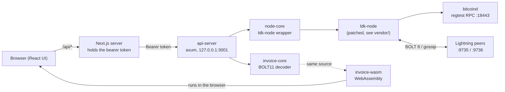
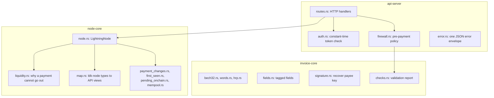
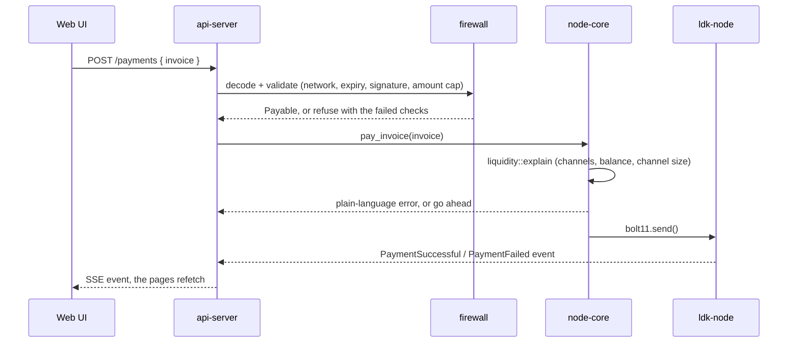

ahead# Lightning Tool: backend

A Rust workspace that powers the Lightning Tool. It contains a hand-written **BOLT11 invoice decoder**, a thin wrapper
around **ldk-node** that runs a real Lightning node, and a **localhost REST API** in front of both. The same decoder
also compiles to **WebAssembly**, so the web app can verify an invoice in the browser without sending it anywhere.

It is built for learning and local development on **regtest** (and signet): open channels, pay invoices and watch the
protocol work, with plain-language errors instead of a bare "payment failed".

> The web app lives in [ligthening-node/frontend](https://github.com/ligthening-node/frontend). The dev scripts that start
> everything together live in [ligthening-node/lightning-tool](https://github.com/ligthening-node/lightning-tool).

---

## Table of contents

- [Table of contents](#table-of-contents)
- [What it does](#what-it-does)
- [Architecture](#architecture)
  - [Layers](#layers)
  - [Paying an invoice, step by step](#paying-an-invoice-step-by-step)
- [Crates](#crates)
- [Quick start](#quick-start)
  - [Prerequisites](#prerequisites)
  - [1. Start bitcoind (regtest)](#1-start-bitcoind-regtest)
  - [2. Run the main node](#2-run-the-main-node)
  - [3. Run a second node to open channels with](#3-run-a-second-node-to-open-channels-with)
  - [4. Fund the node and mine blocks](#4-fund-the-node-and-mine-blocks)
  - [Decode an invoice from the terminal](#decode-an-invoice-from-the-terminal)
- [Configuration](#configuration)
- [REST API](#rest-api)
  - [Errors](#errors)
  - [Example session](#example-session)
- [Payment safety rules](#payment-safety-rules)
- [Code snippets](#code-snippets)
  - [Decode an invoice](#decode-an-invoice)
  - [Why a payment cannot go out](#why-a-payment-cannot-go-out)
  - [Constant-time token check](#constant-time-token-check)
  - [Live events](#live-events)
- [Generated code for the frontend](#generated-code-for-the-frontend)
- [Testing](#testing)
- [Docker](#docker)
- [Project layout](#project-layout)
- [License](#license)

---

## What it does

| Area | Capability |
|---|---|
| **Invoice decoding** | Parses and validates BOLT11 invoices from scratch (bech32, tagged fields, signature recovery) and returns a verdict plus a list of individual checks. |
| **Lightning node** | Starts an ldk-node instance with its own seed, on-chain wallet, peers, channels, invoices and payments. |
| **REST API** | Exposes the node and the decoder over HTTP on `127.0.0.1`, protected by a bearer token. |
| **Live events** | Streams payment and channel events to the UI over Server-Sent Events. |
| **Plain-language errors** | Explains why a payment cannot go out: no channel, channel still confirming, balance is only the reserve, or the payment is as large as the channel. |
| **WebAssembly build** | The decoder runs unchanged in the browser. |
| **CLI** | `invoice-cli decode` decodes an invoice in the terminal. |

## Architecture



**The browser never talks to the API directly.** The Next.js server keeps `LN_API_TOKEN`, forwards only an allow-list of
routes, and adds the `Authorization` header. The token never reaches client JavaScript.

### Layers



### Paying an invoice, step by step



## Crates

| Crate | Purpose |
|---|---|
| [`invoice-core`](crates/invoice-core) | Hand-written BOLT11 decoder and validator. No I/O, never reads the clock (time and policy come in through `DecodeContext`), so results are deterministic and it compiles to WASM. |
| [`invoice-wasm`](crates/invoice-wasm) | Browser entry point. Results cross the boundary as JSON strings shaped by the same Rust structs. |
| [`invoice-cli`](crates/invoice-cli) | `invoice-cli decode <invoice>`. Exit codes: `0` payable, `1` not payable, `2` unreadable. |
| [`node-core`](crates/node-core) | Wrapper around ldk-node: lifecycle, on-chain wallet, peers, channels, invoices, payments, events. The seed stays inside ldk-node's storage directory and is never exposed. |
| [`api-server`](crates/api-server) | axum REST API that binds to loopback, checks a bearer token and runs payment policy before paying. |

`vendor/ldk-node` is a local copy of ldk-node 0.7.0 with **two changes**, both in `[patch.crates-io]` in `Cargo.toml`:

1. Channels accept a payment of up to 100% of their size (upstream caps it at 10%). See `src/config.rs`.
2. On regtest the fee rate is pinned (`REGTEST_FEE_RATE_SAT_PER_KWU` in `src/chain/bitcoind.rs`), so the first
   commitment transaction of a new channel costs about 500 sat. Without it, bitcoind's estimate climbs as test blocks
   fill up and the opening fee reaches thousands of sat (3,156 sat was seen), which pushed the smallest working channel
   from about 2,300 sat to over 4,000 sat. With the pinned fee, a 2,300 sat channel opens and is usable.

## Quick start

### Prerequisites

- Rust 1.85 or newer
- Docker (for the regtest `bitcoind`)
- Optional: `wasm-pack` to rebuild the WebAssembly module

### 1. Start bitcoind (regtest)

```bash
export LN_API_TOKEN=$(openssl rand -hex 32)
docker compose up -d --wait bitcoind        # compose file lives in the lightning-tool repo
```

RPC user and password are both `lightning`.

### 2. Run the main node

```bash
LN_API_TOKEN=$LN_API_TOKEN \
LN_RPC_USER=lightning \
LN_RPC_PASSWORD=lightning \
LN_DATA_DIR=../.regtest-data/main-node \
cargo run -p api-server
```

The API listens on `127.0.0.1:3001` and Lightning on `127.0.0.1:9735`.

### 3. Run a second node to open channels with

```bash
LN_API_TOKEN=$LN_API_TOKEN \
LN_RPC_USER=lightning \
LN_RPC_PASSWORD=lightning \
LN_DATA_DIR=../.regtest-data/peer-node \
LN_API_PORT=3002 \
LN_LISTEN_ADDRESS=127.0.0.1:9736 \
LN_NODE_ALIAS=regtest-peer \
cargo run -p api-server
```

Keep the same `LN_DATA_DIR` to keep the same node id and channels. A new path creates a brand-new node.

### 4. Fund the node and mine blocks

```bash
scripts/regtest.sh fund <address> 0.1       # sends coins from bitcoind's wallet and mines 6 blocks
scripts/regtest.sh mine 6                   # confirm a channel opening
```

### Decode an invoice from the terminal

```bash
cargo run -p invoice-cli -- decode lnbcrt20u1p...
```

## Configuration

All settings are environment variables.

| Variable | Default | Meaning |
|---|---|---|
| `LN_API_TOKEN` | required | Bearer token, at least 16 characters. |
| `LN_RPC_PASSWORD` | required | bitcoind RPC password. |
| `LN_RPC_USER` | `polaruser` | bitcoind RPC user. |
| `LN_RPC_HOST` / `LN_RPC_PORT` | `127.0.0.1` / `18443` | bitcoind RPC address. |
| `LN_NETWORK` | `regtest` | `regtest` or `signet`. |
| `LN_API_PORT` | `3001` | Port of the REST API. |
| `LN_API_BIND` | `loopback` | `loopback` (127.0.0.1) or `container` (0.0.0.0, for Docker). |
| `LN_DATA_DIR` | `./ldk-data` | Node storage: seed, channels, payments. |
| `LN_LISTEN_ADDRESS` | `127.0.0.1:9735` | Lightning peer-to-peer address. |
| `LN_NODE_ALIAS` | `lightning-tool` | Alias shown to peers. |
| `LN_MAX_PAY_MSAT` | `1000000000` | Largest payment the API will make (1,000,000 sat). |

## REST API

Every route except `/health` needs `Authorization: Bearer <LN_API_TOKEN>`. **Amounts are JSON strings**, because msat
values can exceed the safe integer range of JavaScript.

| Method | Path | Purpose |
|---|---|---|
| `GET` | `/health` | Liveness, no token needed. |
| `GET` | `/node/status` | Node id, block height, sync state. |
| `POST` | `/node/sync` | Force a chain and wallet sync. |
| `POST` | `/wallet/address` | New on-chain receive address. |
| `GET` | `/wallet/balance` | On-chain and Lightning balances. |
| `POST` | `/wallet/send` | Send on-chain. |
| `GET` / `POST` | `/peers` | List peers, connect to a peer. |
| `POST` | `/peers/disconnect` | Disconnect from a peer. |
| `GET` / `POST` | `/channels` | List channels, open a channel. Opening needs a peer that is connected right now (`POST /peers` first), otherwise it is refused. |
| `POST` | `/channels/close` | Close a channel (cooperative or force). |
| `POST` | `/invoices` | Create a BOLT11 invoice. |
| `GET` / `POST` | `/payments` | List payments, pay an invoice. |
| `GET` | `/events` | Server-Sent Events stream. |
| `POST` | `/decode` | Decode and validate an invoice. |

### Errors

Every error uses one envelope, so clients handle a single shape:

```json
{
  "error": {
    "code": "insufficient_liquidity",
    "message": "A 200,000 sat channel cannot carry a payment of 200,000 sat or more. Pay less than the channel amount, or open a bigger channel first."
  }
}
```

### Example session

```bash
export LN_API_TOKEN=...
H="authorization: Bearer $LN_API_TOKEN"

# Open a 200,000 sat channel from the main node to the peer
curl -s -H "$H" -H 'content-type: application/json' \
  --data '{"node_id":"<peer node id>","address":"127.0.0.1:9736","amount_sat":"200000"}' \
  127.0.0.1:3001/channels

# After 6 confirmations, the peer creates a 50,000 sat invoice
curl -s -H "$H" -H 'content-type: application/json' \
  --data '{"amount_msat":"50000000","description":"coffee"}' \
  127.0.0.1:3002/invoices

# The main node pays it
curl -s -H "$H" -H 'content-type: application/json' \
  --data '{"invoice":"lnbcrt500u1p..."}' \
  127.0.0.1:3001/payments
```

## Payment safety rules

Before the node sends a payment it passes two gates.

**1. The firewall (`api-server/src/firewall.rs`)** decodes the invoice with `invoice-core` and refuses unless the verdict
is `Payable`: right network, not expired, valid signature, within `LN_MAX_PAY_MSAT`, and from the expected payee when
one is given.

**2. The liquidity check (`node-core/src/liquidity.rs`)** explains in plain words why a payment cannot go out:

| Situation | Message |
|---|---|
| No channel at all | "You have no channels yet. Open one on the Channels page before paying." |
| Channels still confirming or peer offline | "None of your channels is usable right now..." |
| Balance is only the reserve | "...all of it is the reserve, which cannot be spent." |
| More than the spendable balance | "That is more than you can send. You can spend X sat..." |
| Opening a channel with a peer that is not connected | "not connected to that peer: connect to it on the Peers card first, then open the channel" |
| Payment equal to or above the channel size | "A 200,000 sat channel cannot carry a payment of 200,000 sat or more." |

A payment **below** the channel size goes through as long as the balance covers it, so 50,000 or 100,000 sat works on a
200,000 sat channel.

## Code snippets

### Decode an invoice

`invoice-core` takes the clock and the policy as input, so the result is deterministic:

```rust
use invoice_core::{decode, DecodeContext, Network, Verdict};

let ctx = DecodeContext {
    now_unix: 1_790_000_000,
    expected_network: Some(Network::Regtest),
    expected_payee: None,
    description_preimage: None,
    max_amount_msat: Some(1_000_000_000),
};

let decoded = decode(invoice, &ctx)?;
if decoded.report.verdict == Verdict::Payable {
    println!("payable, {} checks passed", decoded.report.checks.len());
}
```

`decode` returns `Err` only when the text cannot be read as an invoice. An invoice that reads fine but is expired or
mis-signed returns `Ok`, with the problems listed in `report`.

### Why a payment cannot go out

```rust
// node-core/src/liquidity.rs
if amount_msat >= largest * 1000 {
    return Some(format!(
        "A {} sat channel cannot carry a payment of {} sat or more. \
         Pay less than the channel amount, or open a bigger channel first.",
        sat_value(largest),
        sat_value(largest)
    ));
}
```

### Constant-time token check

```rust
// api-server/src/auth.rs
let allowed = match presented {
    Some(token) => token.as_bytes().ct_eq(state.token.as_bytes()).into(),
    None => false,
};
```

### Live events

One task drains ldk-node's event queue into a broadcast channel, and each SSE client subscribes to it:

```rust
pub async fn pump_events(node: LightningNode, events: broadcast::Sender<NodeEvent>) {
    loop {
        match node.next_event().await {
            Ok(event) => { let _ = events.send(event); }
            Err(err) => eprintln!("could not mark event handled: {err}"),
        }
    }
}
```

Events: `PaymentSuccessful`, `PaymentFailed`, `PaymentReceived`, `ChannelPending`, `ChannelReady`, `ChannelClosed`.

## Generated code for the frontend

`invoice-core`'s types are exported to TypeScript with **ts-rs**, and the decoder is built to WebAssembly with
**wasm-pack**. Both land in the frontend repo, so it builds without a Rust toolchain:

```bash
scripts/build-wasm.sh
# types -> ../frontend/lib/types
# wasm  -> ../frontend/lib/invoice-wasm
```

This script expects `frontend/` next to `backend/`. CI fails when `frontend/lib/types` is out of date.

## Testing

```bash
cargo test --workspace                                              # unit and integration tests
cargo clippy --workspace --all-targets --all-features -- -D warnings
cargo fmt --all -- --check
```

| Suite | Covers |
|---|---|
| `invoice-core/tests/spec_vectors.rs` | The BOLT11 specification's own example invoices. |
| `invoice-core/tests/real_invoices.rs` | Invoices produced by real nodes. |
| `invoice-core/tests/properties.rs` | Property tests with `proptest`. |
| `invoice-core/tests/tampering.rs` | Bit flips and edits must be caught. |
| `invoice-core/tests/robustness.rs` | Garbage input never panics. |
| `node-core/src/liquidity.rs` | One test per payment-refusal message. |
| `node-core/tests/regtest.rs` | End to end against a real regtest `bitcoind`. |
| `api-server/tests/api.rs` | Auth, routing and the error envelope. |

## Docker

```bash
docker build -t lightning-api .
docker run -e LN_API_TOKEN=... -e LN_RPC_PASSWORD=... -p 127.0.0.1:3001:3001 lightning-api
```

The image sets `LN_API_BIND=container`, so the API listens on `0.0.0.0` inside the container. Publish it to
`127.0.0.1` on the host so it stays local.

## Project layout

```
backend/
  Cargo.toml                  workspace, ldk-node patch
  vendor/ldk-node/            ldk-node 0.7.0 with the 100% in-flight change
  scripts/
    regtest.sh                mine blocks, fund an address, call the peer
    build-wasm.sh             generate TS types and the WASM module
  crates/
    invoice-core/             BOLT11 decoder and validator
    invoice-wasm/             WebAssembly build of the decoder
    invoice-cli/              terminal decoder
    node-core/                ldk-node wrapper and liquidity rules
    api-server/               axum REST API, auth, firewall
```

## License

The workspace declares `license = "MIT"` in `Cargo.toml`. A `LICENSE` file has not been added yet.
